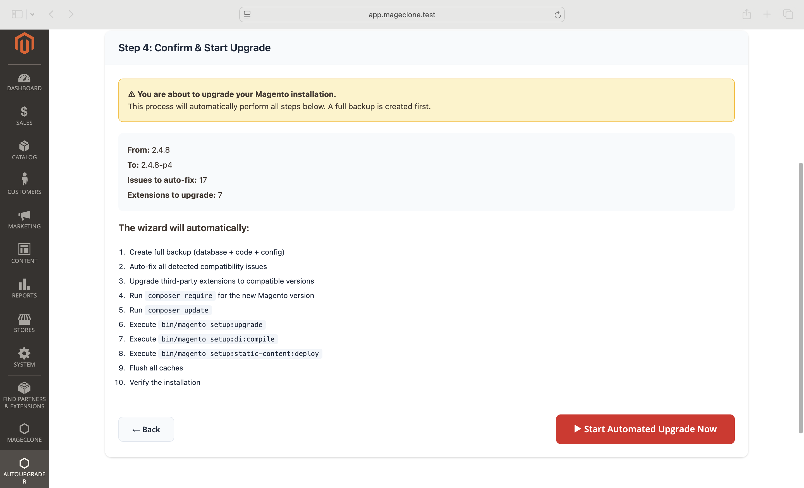
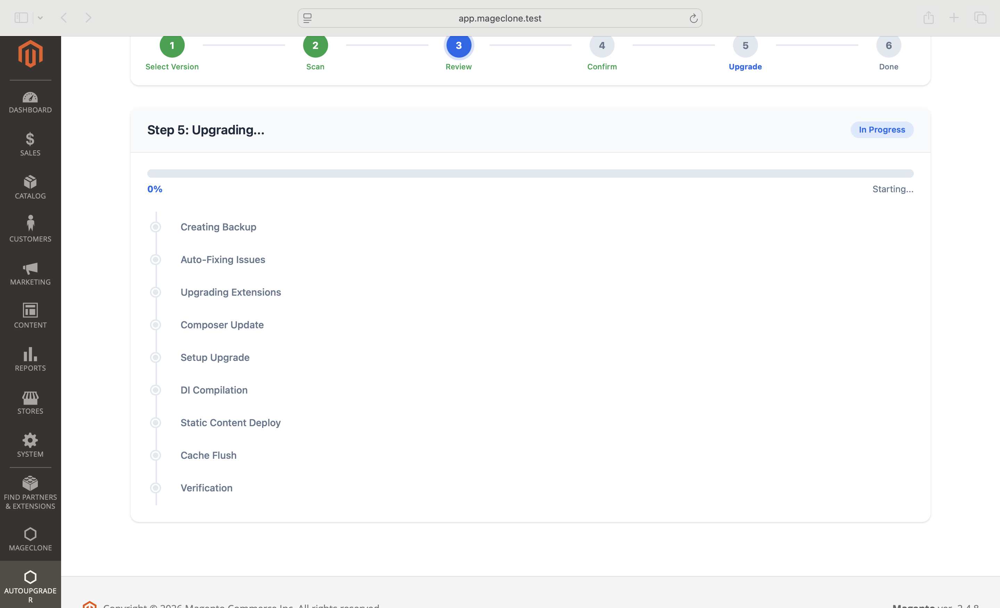

# MageUpgrade AutoUpgrader

**Magento 2.4.8 Automated Upgrade Plugin**

Fully automated Magento version migration with modern admin UI, real-time progress tracking, compatibility scanning, auto-fix engine, extension management, and backup/rollback support.

---

## Screenshots

### Step 1: Select Target Version


Select your target Magento version from the dropdown. Patches and security updates are listed automatically.


Shows upgrade path (2.4.8 → 2.4.8-p4) and PHP requirements.

---

### Step 2: Compatibility Scan


Real-time scan of your codebase with terminal-style log output.

---

### Step 3: Review & Auto-Fix


Summary cards show Critical, Warnings, Auto-Fixable, and Total Issues. The **"Apply All Auto-Fixes"** button fixes all auto-fixable issues in one click.


**Upgrade Readiness** panel with green/red/yellow indicators. Critical issues block the upgrade.


After applying auto-fixes: Auto-Fixable drops to 0, all readiness checks turn green.


Issues table showing severity, file location, description, and **Fixed** status after auto-fix.


Extension compatibility table showing current version, compatible version, and status.

---

### Step 4: Confirm Upgrade


Review upgrade summary: source/target version, issues to auto-fix, extensions to upgrade.



Full list of automated steps with the **"Start Automated Upgrade Now"** button.

---

### Step 5: Live Progress


Real-time upgrade progress with animated timeline.



All 9 upgrade steps: Backup → Auto-Fix → Extensions → Composer → Setup → Compile → Static Deploy → Cache → Verify.

---

## Features

- **Step-by-Step Wizard** — 6-step guided upgrade process with modern UI
- **Compatibility Scanner** — Scans custom code for deprecated classes, methods, PHP incompatibilities, plugin conflicts, template overrides, and composer constraints
- **Auto-Fix Engine** — One-click fix for all auto-fixable issues (deprecated classes, methods, PHP functions, composer constraints)
- **Upgrade Readiness Gating** — Blocks upgrade until all critical issues are resolved
- **Extension Manager** — Finds compatible versions for all 3rd-party extensions
- **Real-Time Progress** — Animated step-by-step timeline with live status updates
- **Backup & Rollback** — Full backup (database + files) before upgrade, one-click rollback
- **CLI Support** — `autoupgrader:scan`, `autoupgrader:upgrade`, `autoupgrader:rollback`

---

## Requirements

- Magento 2.4.x (optimized for 2.4.8)
- PHP 8.1+ (8.3/8.4 recommended)
- Composer 2.x

---

## Installation

### Via app/code (manual)

```bash
cp -r MageUpgrade /path/to/magento/app/code/
bin/magento module:enable MageUpgrade_AutoUpgrader
bin/magento setup:upgrade
bin/magento setup:di:compile
bin/magento cache:flush
```

### Via Composer (packagist/private repo)

```bash
composer require mageupgrade/module-autoupgrader
bin/magento setup:upgrade
bin/magento setup:di:compile
bin/magento cache:flush
```

---

## Usage

### Admin Panel

Navigate to **Admin > AutoUpgrader** in the sidebar:

| Menu Item | Description |
|-----------|-------------|
| Upgrade Dashboard | 6-step wizard: select version, scan, review, confirm, upgrade, done |
| Compatibility Scan | Detailed scan with file-level issues and extension table |
| Upgrade History | Grid listing all past upgrades with status |

### CLI Commands

```bash
# Scan for compatibility issues
bin/magento autoupgrader:scan 2.4.8-p4

# Run full upgrade (interactive confirmation)
bin/magento autoupgrader:upgrade 2.4.8-p4

# Skip confirmation
bin/magento autoupgrader:upgrade 2.4.8-p4 --yes

# Rollback a failed upgrade
bin/magento autoupgrader:rollback <upgrade_id>
```

---

## Auto-Fix Capabilities

| Category | Example | Auto-Fixable |
|----------|---------|:------------:|
| Deprecated Classes | `Zend_Json` → `Magento\Framework\Serialize\Serializer\Json` | Yes |
| Deprecated Methods | `getEntityId()` → `getId()` | Yes |
| PHP Compatibility | `utf8_encode()` → `mb_convert_encoding()` | Yes |
| Composer Constraints | `1.0.0` → `>=1.0.0` | Yes |
| Class Overrides | Preferences on core classes | No |
| Template Overrides | Custom .phtml overriding core | No |

---

## Architecture

```
app/code/MageUpgrade/AutoUpgrader/
├── Api/                    # Service contracts (7 interfaces)
├── Block/Adminhtml/        # Admin blocks
├── Console/Command/        # CLI commands (scan, upgrade, rollback)
├── Controller/Adminhtml/   # Admin controllers
├── docs/                   # User guide & screenshots
├── Helper/                 # Configuration helper
├── Model/                  # Data models & resource models
├── Service/                # Core services (7 implementations)
├── etc/                    # Module config, DI, routes, ACL, schema
├── i18n/                   # Translations
└── view/adminhtml/         # Templates, layouts, JS, CSS
```

---

## Documentation

See [User Guide](docs/USER_GUIDE.md) for detailed step-by-step instructions.

---

## License

Proprietary

## Author

Manali Patel — manali21p@gmail.com
