# MageUpgrade AutoUpgrader - User Guide

## Table of Contents

1. [Getting Started](#getting-started)
2. [Step 1: Select Target Version](#step-1-select-target-version)
3. [Step 2: Compatibility Scan](#step-2-compatibility-scan)
4. [Step 3: Review & Auto-Fix](#step-3-review--auto-fix)
5. [Step 4: Confirm Upgrade](#step-4-confirm-upgrade)
6. [Step 5: Live Upgrade Progress](#step-5-live-upgrade-progress)
7. [Step 6: Completion](#step-6-completion)
8. [CLI Usage](#cli-usage)
9. [Rollback](#rollback)
10. [Troubleshooting](#troubleshooting)

---

## Getting Started

After installation, navigate to **Admin > AutoUpgrader > Upgrade Dashboard** in the Magento admin sidebar.

The wizard will guide you through 6 steps to safely upgrade your Magento installation.

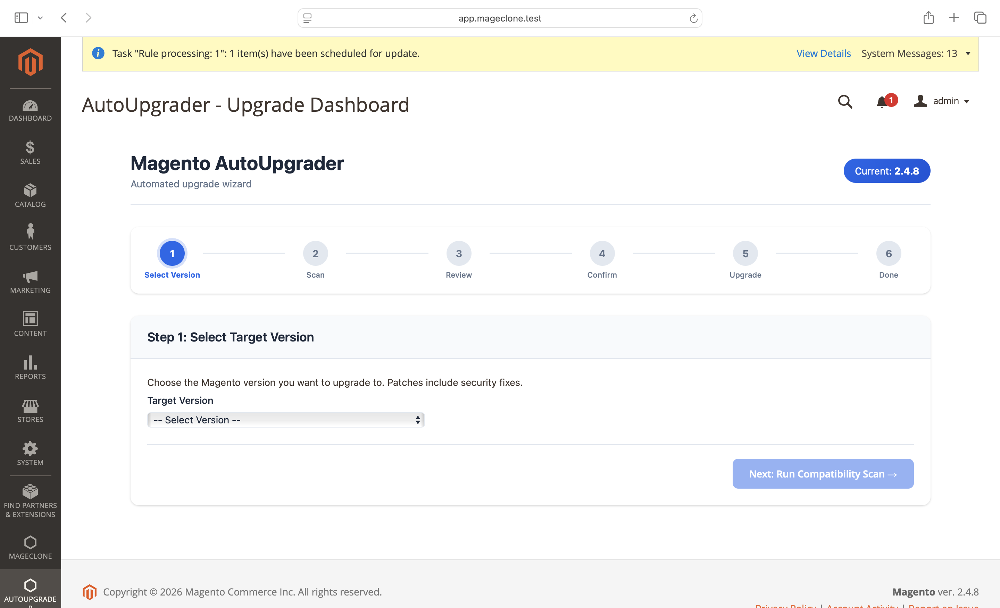

---

## Step 1: Select Target Version

Choose the Magento version you want to upgrade to from the dropdown. Available versions are fetched automatically and include security patches.

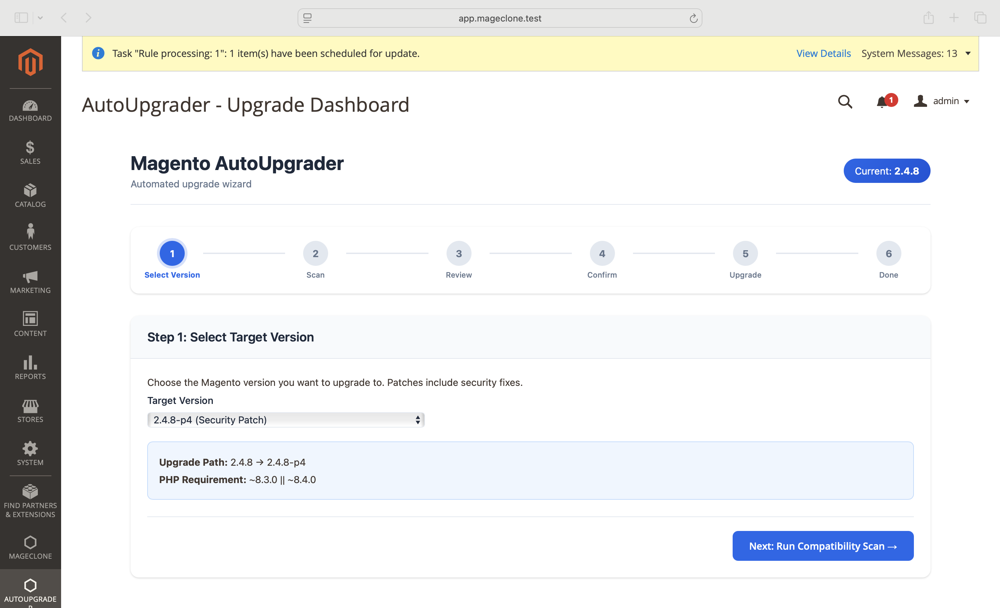

**What you'll see:**
- Dropdown with all available versions newer than your current version
- Security patches labeled with "(Security Patch)"
- Upgrade path showing current version → target version
- PHP requirement for the selected version

> **Tip:** Always prefer the latest patch version for security fixes.

---

## Step 2: Compatibility Scan

After selecting a version, the wizard automatically scans your entire codebase for compatibility issues.

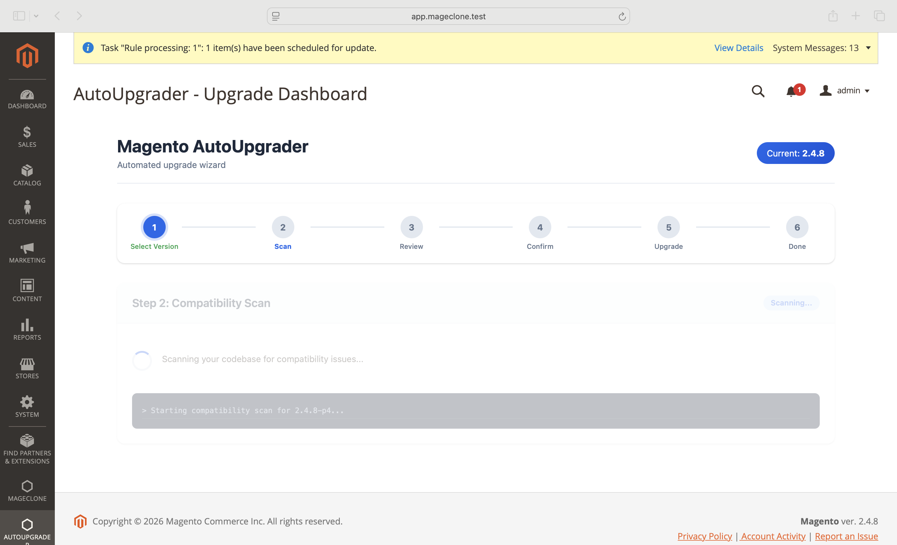

**What gets scanned:**
- Custom modules (`app/code/`) for deprecated class usage
- Deprecated method calls (e.g., `getEntityId` → `getId`)
- PHP version compatibility (e.g., `utf8_encode` removed in PHP 8.2+)
- Plugin/preference conflicts with core classes
- Composer version constraints
- Template overrides that may break

The scan log shows real-time progress in a terminal-style console.

---

## Step 3: Review & Auto-Fix

This is the most important step. Review all detected issues before proceeding.

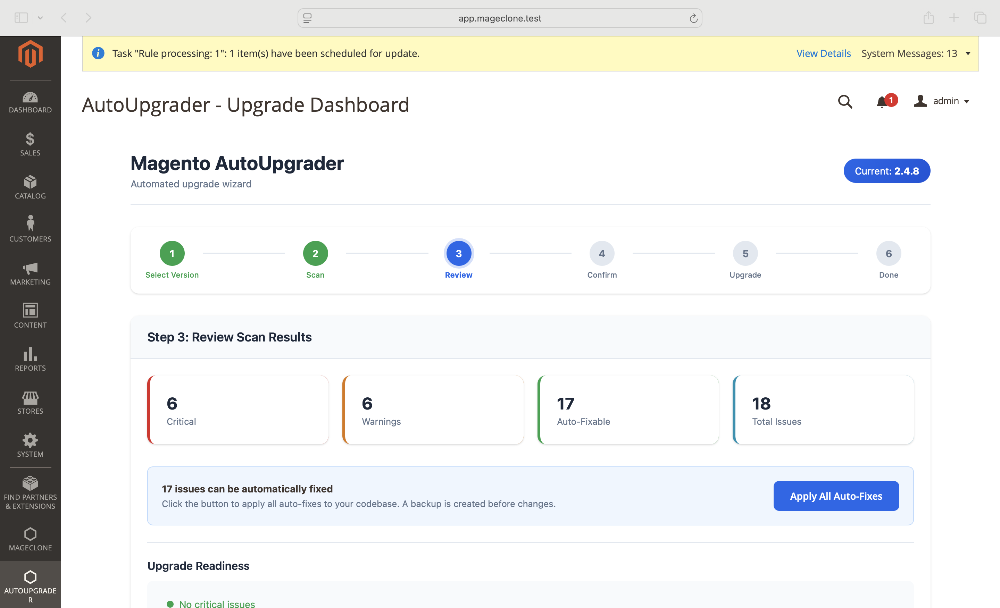

### Summary Cards
Four cards show at-a-glance stats:
- **Critical** (red) — Must be fixed before upgrading
- **Warnings** (yellow) — Recommended to fix
- **Auto-Fixable** (green) — Can be fixed with one click
- **Total Issues** (blue) — Overall count

### Auto-Fix Button

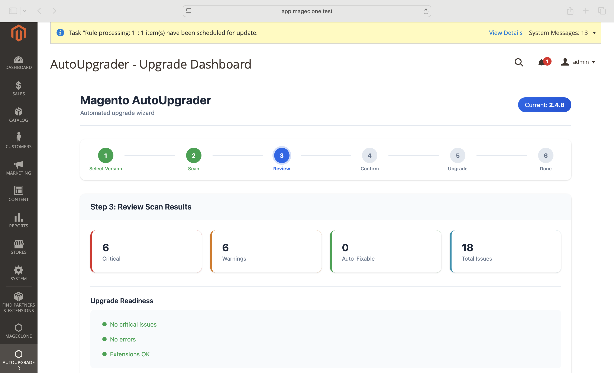

If auto-fixable issues exist, a blue "Apply All Auto-Fixes" button appears. Click it to:
- Replace deprecated classes with their replacements
- Update deprecated method calls (e.g., `getEntityId` → `getId`)
- Fix PHP compatibility issues (e.g., `utf8_encode` → `mb_convert_encoding`)
- Loosen restrictive composer constraints

A backup of each file is created before modification.

### Upgrade Readiness

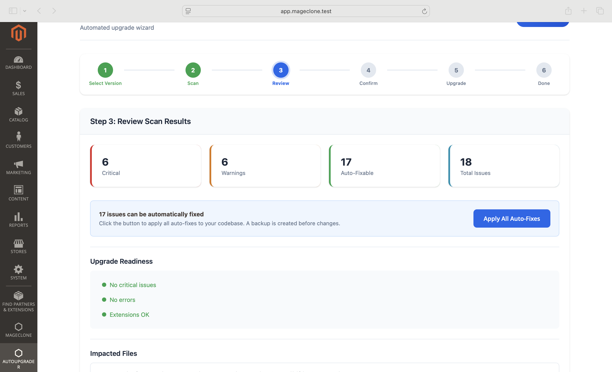

The readiness panel shows green/red/yellow indicators:
- **Green dot** — No issues in this category
- **Red dot** — Critical issues that BLOCK the upgrade
- **Yellow dot** — Warnings that are recommended but don't block

> **Important:** You cannot proceed to the upgrade until all critical issues are resolved (either auto-fixed or manually fixed).

### Issues Table

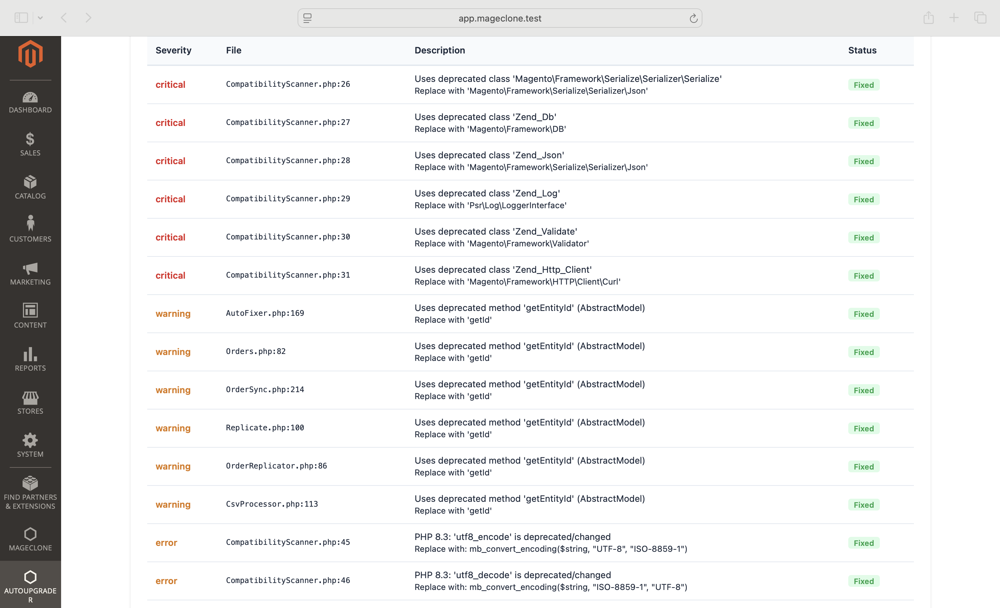

Each issue shows:
| Column | Description |
|--------|-------------|
| Severity | critical / error / warning / info |
| File | Filename and line number |
| Description | What the issue is and suggested fix |
| Status | **Auto-Fixable**, **Fixed**, or **Manual** |

### Extension Compatibility

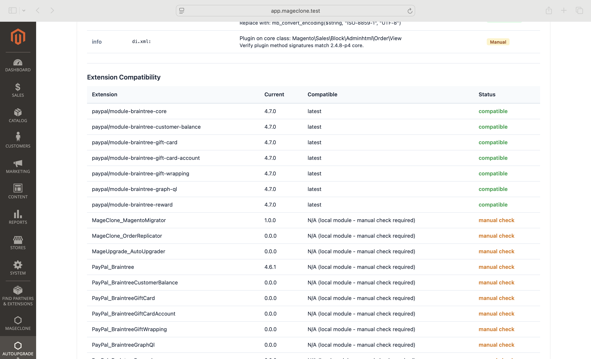

Shows all third-party extensions with:
- Current installed version
- Compatible version for the target Magento version
- Status: **compatible**, **will check during upgrade**, **manual check**, or **no compatible version**

---

## Step 4: Confirm Upgrade

Review the upgrade summary and confirm you want to proceed.

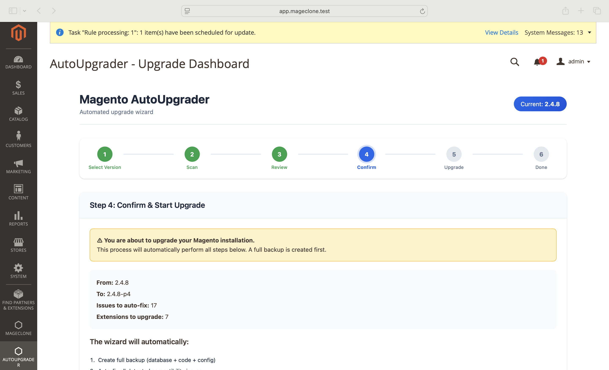

**What you'll see:**
- Source and target version
- Number of auto-fixes to apply
- Number of extensions to upgrade
- Complete list of automated steps

> **Warning:** Once started, the upgrade should not be interrupted. A full backup is created first.

Click **"Start Automated Upgrade Now"** to begin.

---

## Step 5: Live Upgrade Progress

Watch the upgrade happen in real-time with an animated progress bar and step-by-step timeline.

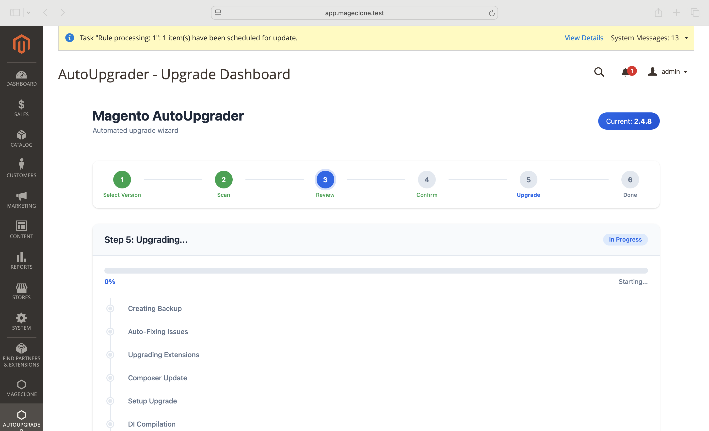

**Upgrade steps shown on timeline:**
1. Creating Backup (database + code)
2. Auto-Fixing Issues
3. Upgrading Extensions
4. Composer Update
5. Setup Upgrade
6. DI Compilation
7. Static Content Deploy
8. Cache Flush
9. Verification

Each step shows:
- **Pending** (gray dot) — Not started
- **Running** (blue pulsing dot) — In progress
- **Completed** (green dot) — Done
- **Failed** (red dot) — Error occurred

If an error occurs, a rollback button appears automatically.

---

## Step 6: Completion

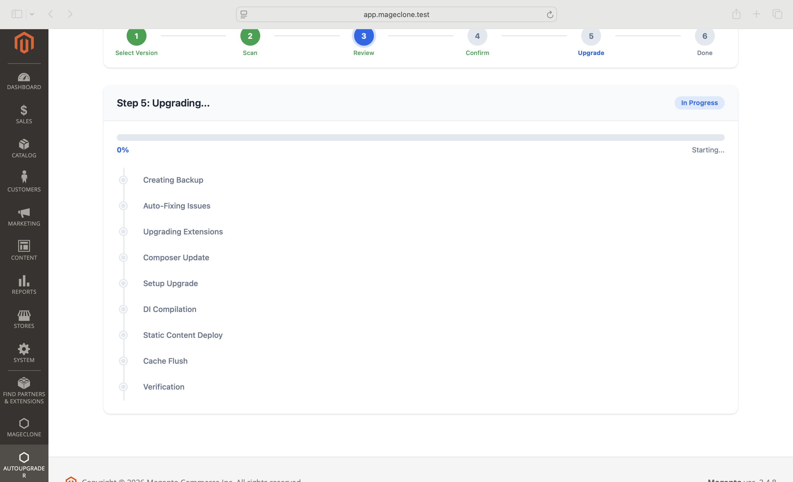

On success:
- Green checkmark with "Upgrade Successful!"
- Shows the upgrade path (from → to)
- Backup location for reference
- Link to return to dashboard

On failure:
- Red X with error details
- Rollback option to restore previous state

---

## CLI Usage

### Scan for Issues

```bash
bin/magento autoupgrader:scan 2.4.8-p4
```

Output shows issues grouped by severity with file paths and suggestions.

### Run Full Upgrade

```bash
# Interactive (asks for confirmation)
bin/magento autoupgrader:upgrade 2.4.8-p4

# Skip confirmation
bin/magento autoupgrader:upgrade 2.4.8-p4 --yes
```

### Rollback

```bash
bin/magento autoupgrader:rollback <upgrade_id>
```

---

## Rollback

If an upgrade fails or causes issues:

### From Admin Panel
1. Go to **AutoUpgrader > Upgrade History**
2. Find the upgrade entry
3. Click "Rollback" action

### From CLI
```bash
bin/magento autoupgrader:rollback <upgrade_id>
```

Rollback restores:
- Database from backup
- Modified files from `.autoupgrader.bak` backups
- Composer lock file

---

## Troubleshooting

### Dropdown shows no versions
- Check if your server can reach `api.github.com`
- Verify you're not already on the latest version
- Run `bin/magento cache:flush` and reload

### Scan shows too many false positives
- The scanner checks all files in `app/code/` — make sure only your custom modules are there
- Core Magento modules should be in `vendor/`, not `app/code/`

### Auto-fix didn't apply
- Check file permissions — files must be writable
- Backup files (`.autoupgrader.bak`) are created alongside originals
- Review the fix log for specific error messages

### Extension shows "not found"
- The extension may be on Magento Marketplace (repo.magento.com) instead of Packagist
- It will be checked during the actual composer update step
- You can manually verify compatibility on the vendor's website

### Compile errors after upgrade
- Run `bin/magento setup:di:compile` manually
- Check for PHP version compatibility in your custom code
- Review the error log at `var/log/system.log`

### Need to rollback manually
```bash
# Restore database
mysql -u root -p magento < var/autoupgrader_backups/<timestamp>/db_backup.sql

# Restore files
find app/code/ -name "*.autoupgrader.bak" -exec sh -c 'mv "$1" "${1%.autoupgrader.bak}"' _ {} \;

# Clear generated
rm -rf generated/code/* generated/metadata/*
bin/magento setup:di:compile
bin/magento cache:flush
```
